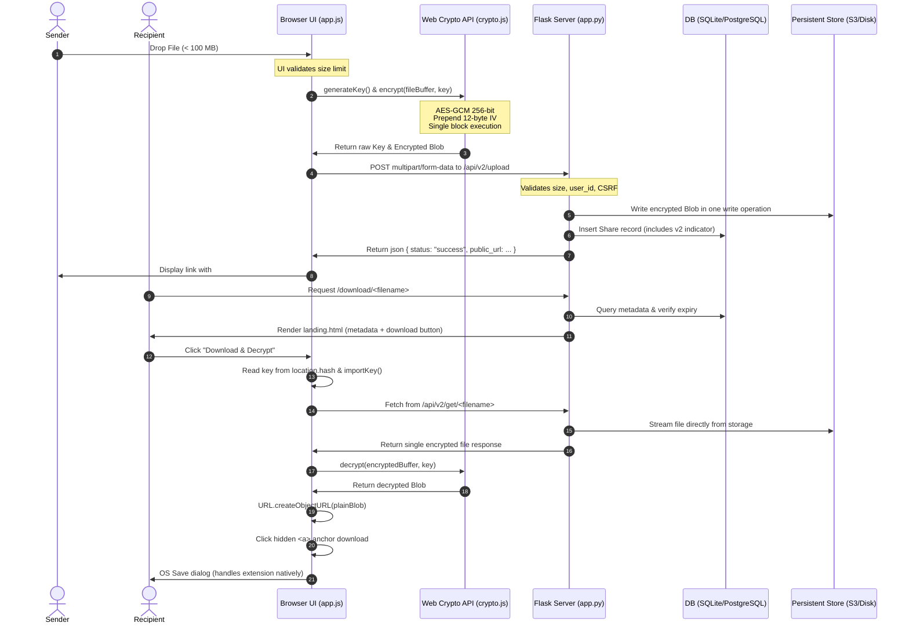

# Obsidian Secure — V2 Architecture Specification

This document details the engineering architecture for Obsidian Secure File Sharing V2, outlining the simplified, single-request, mobile-friendly design optimized for payloads up to 100 MB.

---

## 1. Complete Architecture Diagram

The V2 architecture operates on a single-request request/response model:



---

## 2. Database Schema

The `Share` model includes a `version` flag to differentiate between legacy V1 (OBSv2 chunk-framed) files and V2 (single-block AES-GCM) files without breaking backward compatibility during the transition.

```python
class Share(db.Model):
    id = db.Column(db.Integer, primary_key=True)
    filename = db.Column(db.String(255), nullable=False)
    original_name = db.Column(db.String(255), nullable=False)
    mime_type = db.Column(db.String(255), nullable=True)
    upload_time = db.Column(db.DateTime, default=datetime.utcnow)
    expiry_time = db.Column(db.DateTime, nullable=False)
    download_count = db.Column(db.Integer, default=0)
    public_url = db.Column(db.String(512), nullable=False)
    user_id = db.Column(db.Integer, db.ForeignKey('user.id'), nullable=True)
    version = db.Column(db.Integer, nullable=False, default=2) # 1 = Legacy OBSv2, 2 = V2 Single Block
```

---

## 3. Upload Flow

1. User selects file (e.g. `BONAFIDE1.pdf`)
   - UI check: If file size > 100 MB, abort upload with error message.
2. Generate Key:
   - `key = crypto.subtle.generateKey({name: "AES-GCM", length: 256})`
3. Read file into RAM ArrayBuffer:
   - `buffer = await file.arrayBuffer()`
4. Encrypt using AES-GCM 256-bit:
   - `iv = crypto.getRandomValues(new Uint8Array(12))`
   - `ciphertext = crypto.subtle.encrypt({name: "AES-GCM", iv: iv}, key, buffer)`
   - Payload is `[12-byte IV][encrypted ciphertext]`
5. POST Payload:
   - Submit via single `fetch()` as `multipart/form-data`
   - Target Endpoint: `/api/v2/upload`
6. Server saves file and creates Share record (`version=2`)
7. Client appends exported base64 key as `location.hash` fragment to the returned public URL.

---

## 4. Download Flow

1. Recipient navigates to `/download/[filename]`
2. Click "Download & Decrypt"
3. Read URL fragment `location.hash` to get Base64 key
4. Fetch complete file from `/api/v2/get/[filename]` (Returns single encrypted Blob)
5. Read response Blob into ArrayBuffer:
   - `buffer = await response.arrayBuffer()`
6. Extract 12-byte IV and Ciphertext:
   - `iv = buffer.slice(0, 12)`
   - `ciphertext = buffer.slice(12)`
7. Decrypt block using Web Crypto API:
   - `plainBuffer = crypto.subtle.decrypt({name: "AES-GCM", iv: iv}, importedKey, ciphertext)`
8. Save to disk using standard `<a download>` anchor execution.

---

## 5. Security Analysis

* **Encryption Integrity:** V2 relies on standard `AES-256-GCM` with a cryptographically secure 12-byte random IV generated per file. This eliminates custom framing and manually-managed counter nonces.
* **Authentication Binding (AAD):** Since the file size is capped at 100 MB and processed in a single cryptographic step, GCM's built-in 16-byte authentication tag validates the integrity of the entire file block. Truncation or frame re-ordering attacks are structurally impossible.
* **Key Isolation:** The encryption key never leaves the client's memory. It is transmitted to the recipient exclusively in the URL hash fragment (`#key=...`), which is never sent to the Flask server in HTTP requests.

---

## 6. API Design

### A. Upload Endpoint (`POST /api/v2/upload`)
* **Request Content-Type:** `multipart/form-data`
* **Request Body:** `file` (Binary payload containing `[12-byte IV][encrypted ciphertext]`)

### B. Download Endpoint (`GET /api/v2/get/<filename>`)
* **Response Content-Type:** `application/octet-stream`
* **Response Body:** Binary stream containing raw `[12-byte IV][encrypted ciphertext]`

---

## 7. Storage Design

* **Persistent Volume Mapping:** To prevent container restarts and idleness sleep cycles from wiping out user files, the application maps the storage path to a Render Persistent Disk.
* **Single File Writes:** Files are written to disk in a single write operation rather than appended iteratively, avoiding partial chunk orphans resulting from interrupted uploads.
