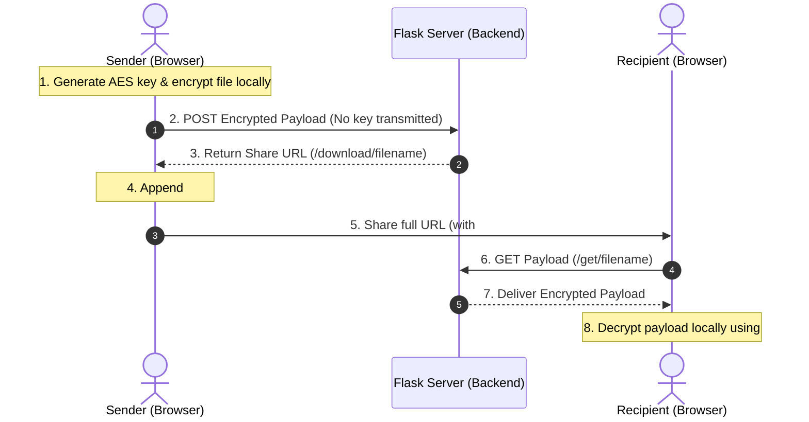

# Obsidian Secure — Zero-Knowledge File & Message Sharing Platform

[](LICENSE)
[](#security-model)

Obsidian Secure is a private, zero-knowledge file-sharing and secure message-sharing platform built to facilitate the confidential exchange of data over untrusted networks. Files are encrypted client-side in the browser before being transmitted, ensuring that the host server never possesses the plaintext data or the decryption keys.

---

## 3-Minute Recruiter Overview

### What the Project Does
Obsidian Secure allows users to securely upload files and write message ciphers that can be shared via self-decrypting URLs. Files are stored on the server as encrypted binary payloads, and messages can be configured to self-destruct (burn) immediately upon being read by the recipient.

### Why it is Technically Interesting
- **True Zero-Knowledge Architecture**: Plaintext data and encryption keys never touch the backend server. The cryptographic keys are appended to the sharing URL as a **URL fragment identifier (`#key`)**. Because fragment identifiers are handled exclusively by the browser and are never sent to the server in HTTP requests, the host operates in absolute blindness.
- **Client-Side Stream Encryption**: Unlike naive applications that load entire files into memory before encrypting (which crashes on larger files), Obsidian Secure performs chunked client-side streaming and encryption using standard Web Crypto APIs, allowing the secure handling of large files directly within standard browser environments.
- **Batched Write Mitigation**: To optimize database performance under heavy user loads (supporting over 1,000 active transfers), the app employs a thread-safe asynchronous metrics batcher (`MetricsBatcher`) in Python to queue and write telemetry data in bulk, mitigating disk bottlenecks.

### Core Technologies
- **Backend**: Python, Flask, SQLAlchemy ORM, Gunicorn, PostgreSQL (Production) / SQLite (Development)
- **Frontend**: HTML5, Vanilla CSS3 (custom CSS design system with HSL variables), Vanilla JS, Web Crypto API
- **Cryptography**: AES-GCM (128-bit/256-bit) client-side key generation and encryption, PBKDF2 (for user password hashing on the server)

---

## Features

- **End-to-End Client-Side Encryption**: Web Crypto API-driven AES-GCM encryption.
- **Zero-Knowledge Architecture**: The server does not store or see the decryption keys.
- **Ephemeral Message Sharing**: Custom ciphers with a strict "burn-on-read" capability.
- **Automatic Link Expiry**: Periodic background cleanup task auto-deletes expired shared files from disk and the database.
- **Dynamic QR Code Sharing**: Instant, client-side SVG QR code generation for secure mobile transfer.
- **Data Isolation**: Custom dashboard lists user-specific shares, setting changes, and notifications.
- **Security Protections**: Session hardening, robust CSRF protection, rate limiting, and strict CSP (Content Security Policy).

---

## Security Model & Architecture



1. **Local Key Generation**: The browser generates a cryptographically secure random symmetric key.
2. **Encryption**: The file/message is encrypted locally in the user's browser using AES-GCM.
3. **Payload Transmission**: The encrypted ciphertext is sent to the server. The key is **not** included in the request payload, headers, or URL path.
4. **Link Formulation**: The key is attached to the sharing link as a fragment (`#<key>`). This fragment is never sent to the server during HTTP requests.
5. **Decryption on Retrieval**: When the recipient loads the link, the browser pulls the key from the fragment, downloads the encrypted payload from the server, and decrypts the file entirely client-side.

---

## Project Structure

```text
├── app.py                     # Main application entry point, routing, and WSGI middleware
├── models.py                  # SQLAlchemy models (User, Share, Transfer, Cipher, Settings)
├── create_admin.py            # CLI bootstrap utility to securely provision admin users
├── pyrightconfig.json         # Static analysis type checker configuration
├── render.yaml                # Render Infrastructure-as-Code (IaC) deployment configuration
├── Procfile                   # Process file for production WSGI server execution
├── runtime.txt                # Python runtime version definition
├── requirements.txt           # Production dependencies (gunicorn, Flask, SQLAlchemy, etc.)
├── templates/                 # Jinja2 HTML templates
│   ├── base.html              # Core application layout and layout styling imports
│   ├── dashboard.html         # User files dashboard, cipher generator, and settings portal
│   ├── landing.html           # Recipient file download and decryption landing page
│   ├── cipher_read.html       # Recipient message decryption and burn portal
│   ├── login.html             # User login portal
│   └── register.html          # User registration portal
├── static/                    # Static assets
│   ├── css/
│   │   ├── styles.css         # Main application visual stylesheet
│   │   └── utilities.css      # Core design system tokens, HSL palettes, and animations
│   ├── js/
│   │   ├── app.js             # Client-side streaming, chunked uploads, and UI logic
│   │   ├── crypto.js          # Web Crypto wrapper (AES-GCM encryption & decryption helper)
│   │   ├── qrcode.min.js      # Client-side QR code generation library
│   │   └── jszip.min.js       # Client-side file bundling engine
│   └── img/                   # Static UI assets and background graphics
├── tests/                     # Test Suites
│   ├── audit_regression.py    # Complete regression suite verifying auth, features, and XSS
│   └── verify_hardening.py    # Target verification verifying security fixes and CSP headers
└── shared_files/              # Upload folder for encrypted binary files (Git ignored)
```

---

## Installation & Local Development

### Prerequisites
- Python 3.11+ installed locally.

### Setup Steps
1. **Clone the Repository**:
   ```bash
   git clone https://github.com/Tejas-Acharya-C/Obsidian-Secure.git
   cd Obsidian-Secure
   ```

2. **Configure Environment Variables**:
   Copy the example configuration file and customize the variables if necessary.
   ```bash
   cp .env.example .env
   ```
   *For local development, the default SQLite configuration in `.env.example` works automatically.*

3. **Install Dependencies**:
   ```bash
   pip install -r requirements.txt
   ```

4. **Initialize Database and Seed Settings**:
   The application initializes the SQLite database (`qr_app.db`) and seeds settings on its initial launch.

5. **Bootstrap the Administrator User**:
   Run the CLI utility to create the primary administrator account:
   ```bash
   python create_admin.py
   ```
   Follow the prompts to enter your custom admin username and password.

6. **Run the Development Server**:
   ```bash
   python app.py
   ```
   The application will be accessible locally at `http://127.0.0.1:5000`.

---

## Deployment

Obsidian Secure is fully configured for production deployment using Gunicorn as the WSGI HTTP server.

### Deploying to Render
1. Create a new Web Service on Render linked to your repository.
2. Render will automatically detect the configuration in `render.yaml`.
3. The configuration will provision:
   - A PostgreSQL database (`obsidian-db`).
   - A persistent disk storage mount (`/var/lib/obsidian/data`) to store the encrypted payloads.
   - Appropriate environment variables (`SECRET_KEY`, `RENDER=1`, `DATABASE_URL`).

---

## Environment Variables

The application reads configurations from environment variables. A template is provided in [.env.example](.env.example):

| Variable | Description | Default Value |
| :--- | :--- | :--- |
| `SECRET_KEY` | Highly secure random key for session signing and CSRF tokens | Dynamic random 32-byte hex |
| `DATABASE_URL` | SQLAlchemy-compatible database connection string | `sqlite:///qr_app.db` |
| `RENDER` | Production flag (forces HSTS, secure cookies, and production URL formatting) | `false` |
| `PERSISTENT_DISK_PATH` | Path on the host filesystem where uploads are written | `./shared_files` |

---

## Known Limitations

- **Large Mobile Downloads**: Since decryption happens entirely client-side, the browser must read the entire encrypted payload into memory/blob storage before saving. Mobile devices with constrained RAM may encounter browser tab crashes when downloading files larger than 1GB.
- **Browser Memory Limitations**: Clients with low physical memory might experience tab crashes during the client-side encryption of files exceeding 2GB.
- **In-App Browser URL Handling**: Some in-app browsers (e.g., inside WeChat, Instagram, or Facebook) strip URL fragments (everything after `#`) when opening links, which removes the decryption key. Users must open links in standard external browsers (Chrome, Safari, Firefox).
- **QR Scanning Camera Quality**: Recipient QR decoding depends on the camera quality of the device scanning the code. Highly complex keys in long URLs generate high-density QR patterns that may require adequate lighting and modern focus capabilities to scan.

---

## Screenshots

* Obsidian Secure Dashboard

*(A visual depiction of the dark-mode glassmorphic theme used across the platform)*

---

## License

This project is licensed under the [MIT License](LICENSE) - see the [LICENSE](LICENSE) file for details.

---

## Security Disclaimer

This project is designed for secure personal and educational file sharing. Please audit the cryptographic implementation independently before using it to protect high-risk production workloads or sensitive enterprise assets.
