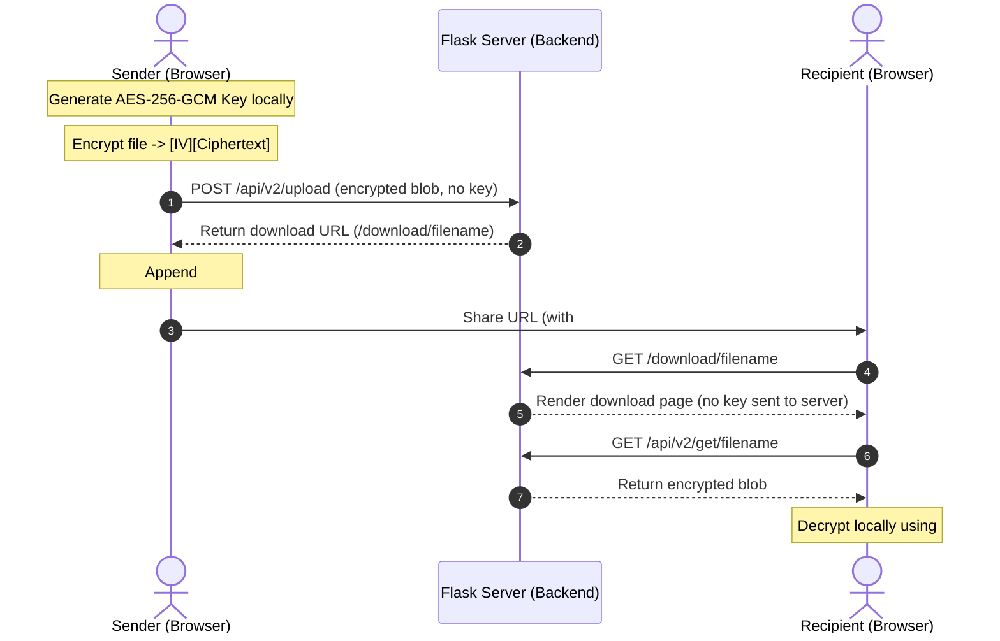

# Obsidian Secure

Obsidian Secure is a professional-grade, zero-knowledge file-sharing and secure messaging platform. Designed with privacy at its core, files and text ciphers are encrypted client-side in the browser using AES-256-GCM before transmission. The host server operates exclusively as a storage and routing relay, with no access to plaintext data or cryptographic keys.

---

## Features

### Authentication & Security Hardening
* **Secure Registration & Login**: User registration and authentication managed securely using PBKDF2 password hashing.
* **IP-Based Rate Limiting**: Dedicated rate-limiting on registration (5 attempts per hour) and login (5 attempts per 15 minutes) to protect endpoints from brute-force attacks.
* **CSRF Protection**: Comprehensive Cross-Site Request Forgery validation on all state-changing endpoints.
* **Secure Session Cookies**: HTTPOnly, SameSite=Lax, and Secure cookie attributes configured for session safety.

### Zero-Knowledge File Sharing (V2)
* **Single-Block AES-256-GCM Encryption**: Files up to 100 MB are encrypted client-side in browser memory using the Web Crypto API, eliminating chunk framing vulnerabilities.
* **Decryption URL Fragments**: Share links contain the decryption key in the URL fragment (`#key=...`), which remains strictly client-side and is never sent to the server.
* **MIME Type Preservation**: Captures, stores, and restores correct MIME types natively on decryption.
* **Automatic Expiry Policies**: Automatic link expiration defaults to 1 hour (with auto-revoke settings enabled) or 7 days (standard).
* **Self-Service Revocation**: Instant, user-triggered revocation of shared files and links.

### Dedicated Active Shares Management (`/active-shares`)
* **Dedicated Management Page**: Dedicated `/active-shares` page (with legacy `/shared` fallback) focused exclusively on active share monitoring, search, filtering, and revocation.
* **15-Minute Expiring Soon Threshold**: Status badges classify shares dynamically: `Active` (> 15 minutes remaining), `Expiring Soon` (<= 15 minutes remaining), or `Expired` (<= 0 minutes remaining).
* **Search, Filters & Sorting**: Real-time client-side filename search, status filter controls (`All`, `Active`, `Expiring Soon`, `Expired`), and timestamp/expiration sorting.
* **Secure Revoke Action**: Direct Revoke action for share deletion. Decryption key copy actions are intentionally excluded to protect zero-knowledge key isolation.

### Secure Messaging
* **Encrypted Ciphers**: Client-side AES-256-GCM text ciphers.
* **Burn-On-Read Mode**: Optional self-destruct mechanism that deletes ciphers permanently from the database after a single view.
* **Preserved Aliasing**: Sender settings capture user alias snapshots at the moment of cipher creation.

### Image Asset Pipeline & SEO Discoverability
* **Optimized WebP & PNG Fallbacks**: Optimized WebP image assets (`logo.webp`, `landing-bg.webp`, `background-pattern.webp`, `internal-background-pattern.webp`) paired with PNG fallbacks for legacy browser support.
* **Unified Application Backgrounds**: Consistent dark mineral visual theme and internal background pattern (`body.app-dashboard-page`) across all authenticated workspace pages.
* **Public Discoverability & Private Route Protection**: Production homepage is fully discoverable via canonical metadata, Open Graph, Twitter cards, and JSON-LD `SoftwareApplication` schema. All authenticated pages and dynamic share/cipher endpoints enforce `noindex, nofollow` headers and `robots.txt` disallow rules.

---

## Architecture Overview

Obsidian Secure implements a zero-knowledge request/response model:



---

## Security Highlights

* **Client-Side Encryption**: All encryption is performed locally inside the browser using the Web Crypto API. Plaintext data never touches the network.
* **AES-256-GCM Cryptography**: Strong authenticated encryption with random 12-byte initialization vectors (IVs) generated per file.
* **Zero-Knowledge Architecture**: The server does not possess plaintext files, messages, or keys.
* **Key Separation (URL Fragments)**: Decryption keys are appended via the `#key` hash fragment. Browsers do not transmit this fragment to the server in HTTP requests, keeping the key isolated to client memory.

---

## Tech Stack

* **Frontend**: Semantic HTML5, Vanilla CSS3 (custom dark mineral design tokens), Vanilla JS (Web Crypto API).
* **Backend**: Python, Flask, SQLAlchemy ORM, Gunicorn (WSGI).
* **Database**: SQLite (local development with WAL enabled) and PostgreSQL (production).
* **Deployment**: Render Web Services with Persistent Disk volumes.

---

## Quick Start

### Prerequisites
* Python 3.11+

### Installation & Run

1. **Clone the Repository**:
   ```bash
   git clone https://github.com/Tejas-Acharya-C/Obsidian-Secure.git
   cd Obsidian-Secure
   ```

2. **Install Dependencies**:
   ```bash
   pip install -r requirements.txt
   ```

3. **Configure Environment**:
   Create a `.env` file in the root directory:
   ```env
   SECRET_KEY=generate_a_random_secret_string
   DATABASE_URL=sqlite:///qr_app.db
   RENDER=false
   ```

4. **Run Server**:
   ```bash
   python app.py
   ```
   Access the local site at `http://127.0.0.1:5000`.

---

## Deployment

To deploy to Render, a complete `render.yaml` infrastructure configuration is provided.

### Required Environment Variables
* `SECRET_KEY`: Permanent, static session signing key.
* `DATABASE_URL`: Connection string for production database (PostgreSQL).
* `RENDER`: Set to `1` to enable production configurations (HTTP Strict Transport Security, secure session cookies, etc.).
* `PUBLIC_BASE_URL`: Base URL of the deployed application (e.g. `https://obsidian-secure-ootw.onrender.com`).
* `PERSISTENT_DISK_PATH`: Set to `/var/lib/obsidian/data` to route file uploads to persistent storage.

---

## Project Structure

```text
├── app.py                     # Main application routing, background cleanup daemon, and migrations
├── models.py                  # SQLAlchemy Models (User, Share, Transfer, Cipher, UserSetting, LoginAttempt)
├── render.yaml                # Render Infrastructure-as-Code (IaC) configuration
├── Procfile                   # Gunicorn WSGI start command
├── requirements.txt           # Dependency manifest
├── templates/                 # Server-rendered HTML templates
├── static/                    # Public assets (design system CSS, vanilla JS, images)
│   ├── css/
│   │   ├── styles.css         # Core layout and structural stylesheet
│   │   └── utilities.css      # Design tokens and responsive utility variables
│   ├── img/                   # WebP optimized images with PNG fallbacks
│   └── js/
│       ├── app.js             # Upload/download management and UI events
│       └── crypto.js          # Web Crypto API wrapper (AES-GCM encryption/decryption)
├── scripts/                   # Administrative and dev cleanup utilities
└── tests/                     # Pytest suite (auth, authorization, shares, crypto, security, SEO, privacy)
```

---

## Documentation

* [Architecture Specification (`docs/ARCHITECTURE.md`)](file:///e:/Python/Python%20projects/Obsidian-Secure-main/docs/ARCHITECTURE.md)
* [Security Specification (`SECURITY.md`)](file:///e:/Python/Python%20projects/Obsidian-Secure-main/SECURITY.md)
* [API Reference (`docs/API.md`)](file:///e:/Python/Python%20projects/Obsidian-Secure-main/docs/API.md)
* [Database Model Reference (`docs/DATABASE.md`)](file:///e:/Python/Python%20projects/Obsidian-Secure-main/docs/DATABASE.md)
* [Deployment Guide (`docs/DEPLOYMENT.md`)](file:///e:/Python/Python%20projects/Obsidian-Secure-main/docs/DEPLOYMENT.md)
* [Changelog (`CHANGELOG.md`)](file:///e:/Python/Python%20projects/Obsidian-Secure-main/CHANGELOG.md)
* [Project Roadmap (`docs/ROADMAP.md`)](file:///e:/Python/Python%20projects/Obsidian-Secure-main/docs/ROADMAP.md)
* [Contributor Guidelines (`CONTRIBUTING.md`)](file:///e:/Python/Python%20projects/Obsidian-Secure-main/CONTRIBUTING.md)

---

## Roadmap

* **Near-Term**: Migrate production storage to Cloudflare R2 / AWS S3 buckets to enable horizontal scaling.
* **Medium-Term**: Implement full PostgreSQL database clustering for multi-region active-active deployment.
* **Long-Term**: Build a native desktop companion client for automated local folder synchronization.

---

## License

This project is licensed under the terms of the [MIT License](LICENSE).
