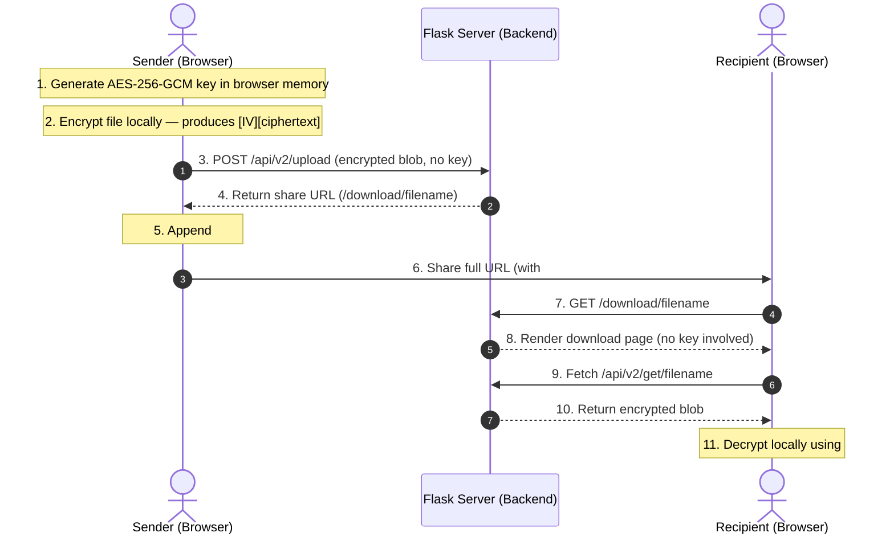

# Obsidian Secure — Zero-Knowledge File & Message Sharing Platform

[](LICENSE)
[](#security-model)

Obsidian Secure is a private, zero-knowledge file-sharing and secure messaging platform. Files are encrypted client-side in the browser using AES-256-GCM before being transmitted. The host server never possesses plaintext data or decryption keys.

---

## 3-Minute Recruiter Overview

### What the Project Does
Obsidian Secure allows users to securely upload files and write encrypted messages that are shared via self-decrypting URLs. Files are stored on the server as encrypted binary payloads. Messages can be configured to self-destruct after a single read.

### Why It Is Technically Interesting

- **True Zero-Knowledge Architecture**: Plaintext data and encryption keys never reach the backend. Keys are appended to the sharing URL as a **URL fragment (`#key=...`)**. Fragment identifiers are browser-only — they are never sent in HTTP requests — so the server operates with no access to the key.
- **Single-Request AES-256-GCM Encryption**: Files up to 100 MB are encrypted entirely in browser memory using the Web Crypto API before upload. A single encrypted blob is transmitted in one request, eliminating the complexity and failure modes of chunked streaming protocols.
- **MIME Type Preservation**: The browser's native MIME type is captured at upload time, stored in the database, and attached to the download page. Decrypted files are reconstructed with their correct MIME type so browsers recognise and open them properly (PDF, DOCX, PNG, etc.).
- **Batched Write Mitigation**: A thread-safe async `MetricsBatcher` queues download telemetry and flushes in bulk, reducing disk I/O under concurrent load.
- **Production Schema Migration**: A safe, additive migration layer runs at startup, detecting and applying missing columns to existing PostgreSQL tables without dropping data or requiring Alembic.

### Core Technologies
- **Backend**: Python, Flask, SQLAlchemy ORM, Gunicorn, PostgreSQL (Production) / SQLite (Development)
- **Frontend**: HTML5, Vanilla CSS3 (custom design system), Vanilla JS, Web Crypto API
- **Cryptography**: AES-256-GCM client-side encryption, PBKDF2 server-side password hashing

---

## Features

### Authentication
- Username/password registration and login
- Rate limiting on login (5 attempts per 15 minutes) and registration (5 per hour)
- CSRF protection on all state-changing endpoints
- Secure session cookies (HttpOnly, SameSite=Lax, Secure in production)

### File Sharing (V2)
- Single-file upload up to 100 MB
- AES-256-GCM encryption entirely in-browser before upload
- MIME type captured, stored, and used to reconstruct correct file type on download
- Expiry: 1 hour (auto-revoke on) or 7 days (auto-revoke off)
- Share links contain the decryption key in the URL fragment — never sent to the server
- QR code generated automatically for each share link
- Revoke access to any active share at any time
- Active shares ledger with open counts and expiry countdowns
- Background cleanup daemon removes expired files and orphaned disk entries every 5 minutes
- Legacy V1 (OBSv2 chunk-framed) shares remain downloadable via auto-detecting decryptor

### Secure Messaging
- AES-256-GCM encrypted text notes created in-browser
- Burn-after-read: message is deleted permanently after the first view
- Optional multi-read mode
- Sender alias snapshot preserved at creation time

### Privacy & Access Controls
- Ghost Mode: hide original filenames from recipients
- Dynamic sender alias: recipients see a display name, never a raw user ID
- No recipient registration required — anyone with the link can decrypt

### Settings
- Change password
- Toggle auto-revoke (1h vs 7d expiry)
- Toggle Ghost Mode
- Set sender display name (alias)
- Usage summary: active share count and encrypted storage used

### Security Hardening
- Strict Content Security Policy (CSP)
- HTTP Strict Transport Security (HSTS) in production
- X-Frame-Options: DENY
- X-Content-Type-Options: nosniff
- Referrer-Policy: no-referrer
- ProxyFix middleware for correct client IP behind Render/Cloudflare

---

## Security Model



1. **Local Key Generation**: The browser generates a cryptographically secure random 256-bit AES-GCM key.
2. **In-Memory Encryption**: The file is read into an `ArrayBuffer` and encrypted in a single operation. A random 12-byte IV is prepended to the ciphertext.
3. **Payload Transmission**: Only the encrypted blob is uploaded. The key is never included in any request.
4. **Link Formulation**: The exported key is appended to the share URL as `#key=BASE64`. The fragment is never transmitted in HTTP requests.
5. **Decryption on Retrieval**: The recipient's browser reads the key from the fragment, fetches the encrypted blob, extracts the IV, and decrypts locally using `crypto.subtle.decrypt`.

---

## Project Structure

```text
├── app.py                     # Flask application, routes, background workers, schema migration
├── models.py                  # SQLAlchemy models (User, Share, Transfer, Cipher, UserSetting)
├── render.yaml                # Render IaC configuration (web service + PostgreSQL + disk)
├── Procfile                   # Gunicorn process definition
├── runtime.txt                # Python 3.11.9 runtime pin
├── requirements.txt           # Production dependencies
├── ARCHITECTURE.md            # V2 architecture specification and sequence diagrams
├── CHANGELOG.md               # Version history
├── templates/
│   ├── base.html              # Base layout, navigation, script includes
│   ├── dashboard.html         # Files, messages, settings, and security pages
│   ├── landing.html           # Recipient file download and decryption page
│   ├── landing_page.html      # Public marketing / home page
│   ├── cipher_read.html       # Recipient message decryption page
│   ├── login.html             # Login page
│   └── register.html          # Registration page
├── static/
│   ├── css/
│   │   ├── styles.css         # Core design system stylesheet
│   │   └── utilities.css      # Design tokens, layout utilities, responsive classes
│   ├── js/
│   │   ├── app.js             # Upload orchestration, download flow, UI interactions
│   │   ├── crypto.js          # Web Crypto API wrapper — AES-256-GCM encrypt/decrypt
│   │   └── qrcode.min.js      # Client-side QR code generation
│   └── img/                   # Logos and background graphics
├── tests/
│   ├── audit_regression.py    # Full regression suite (auth, uploads, security, XSS)
│   └── verify_hardening.py    # Security hardening verification
└── shared_files/              # Encrypted upload storage (not committed)
```

---

## Installation & Local Development

### Prerequisites
- Python 3.11+

### Setup

1. **Clone the repository**:
   ```bash
   git clone https://github.com/Tejas-Acharya-C/Obsidian-Secure.git
   cd Obsidian-Secure
   ```

2. **Install dependencies**:
   ```bash
   pip install -r requirements.txt
   ```

3. **Run the development server**:
   ```bash
   python app.py
   ```
   Accessible at `http://127.0.0.1:5000`.

The application initialises a local SQLite database (`qr_app.db`) and creates all tables automatically on first run. No additional setup is required for local development.

---

## Deployment

### Deploying to Render

The repository includes a complete `render.yaml` that provisions:
- A Python web service running Gunicorn
- A PostgreSQL database (`obsidian-db`, free plan)
- A persistent disk at `/var/lib/obsidian/data` (paid plan required for disk)

**Required environment variables** (set in the Render dashboard):

| Variable | Description | Example |
|---|---|---|
| `SECRET_KEY` | Persistent session signing key | `openssl rand -hex 32` output |
| `DATABASE_URL` | PostgreSQL connection string | Auto-injected from `obsidian-db` |
| `RENDER` | Production flag | `1` |
| `PUBLIC_BASE_URL` | Canonical public URL of the service | `https://obsidian-secure-ootw.onrender.com` |
| `PERSISTENT_DISK_PATH` | Mount path for uploaded files | `/var/lib/obsidian/data` |

> **Important**: `SECRET_KEY` must be a fixed, persistent value. If it is absent or changes between restarts, all existing sessions will be invalidated and users will see a 500 error on `/login` and `/register`. Set it once and do not regenerate it.

> **Free tier note**: Render's persistent disk requires a paid plan. On the free tier, uploaded files are stored on the container's ephemeral filesystem and will be lost on every redeploy or after 15 minutes of inactivity. Use share links promptly.

---

## Known Limitations

- **100 MB file limit**: AES-256-GCM encryption operates on the full file in browser memory. Files larger than 100 MB may cause tab crashes on memory-constrained devices, particularly mobile browsers. The limit is enforced client-side.
- **Ephemeral storage on free tier**: Without a persistent disk, files do not survive Render service restarts or the 15-minute inactivity sleep. See the deployment section above.
- **In-app browser URL fragment stripping**: Some in-app browsers (WeChat, Instagram, Facebook) strip URL fragments (`#key=...`) when opening links, which removes the decryption key. Users must open share links in a standard external browser (Chrome, Safari, Firefox).
- **Single-file uploads**: The V2 architecture uploads one file per share. Multi-file sharing is not supported in the current version.

---

## License

This project is licensed under the [MIT License](LICENSE).

---

## Security Disclaimer

This project is designed for secure personal and educational file sharing. Audit the cryptographic implementation independently before using it to protect high-risk or enterprise-critical assets.
