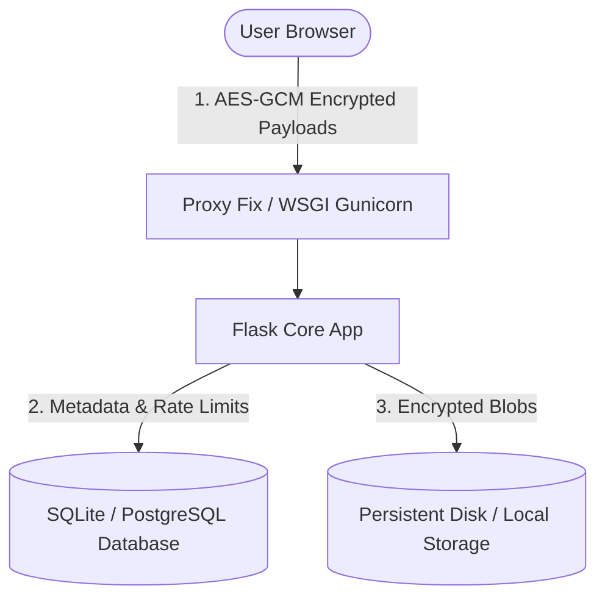
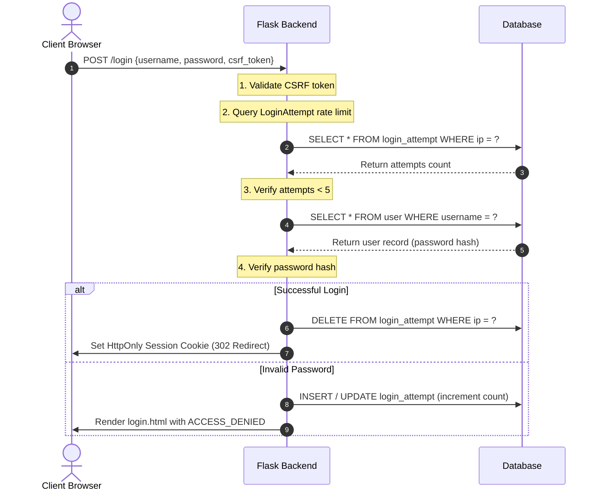
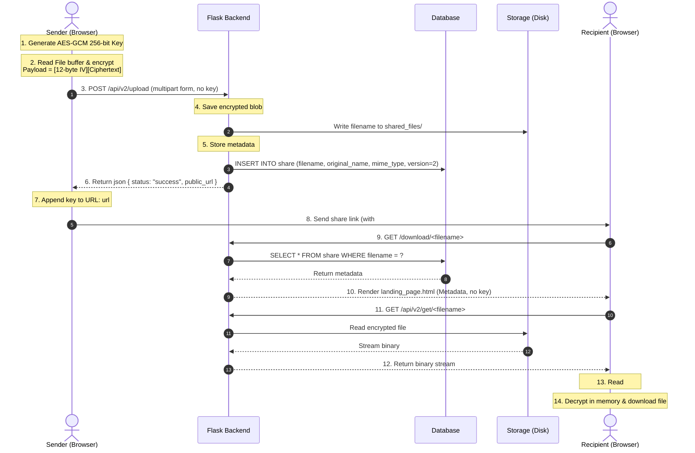
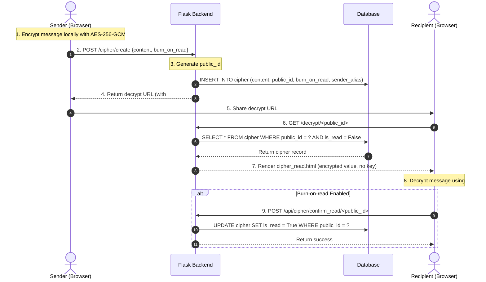
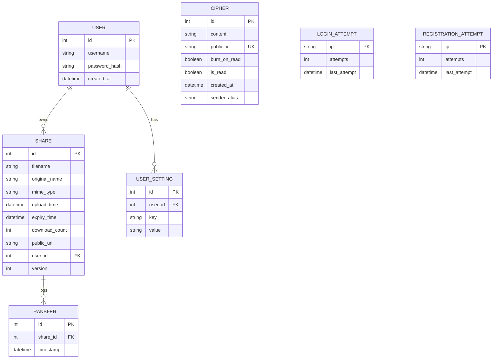

# Obsidian Secure — Architecture Specification

This document provides a detailed specification of the technical architecture, sequence flows, database models, security designs, asset pipelines, and deployment models for Obsidian Secure.

---

## System Overview

Obsidian Secure is designed around a strictly decoupled zero-knowledge model. The frontend browser context acts as the trusted execution environment for all cryptographic operations, while the backend server acts as an untrusted metadata indexer and storage relay.



---

## Application Structure & View Separation

The application enforces a structural separation between file creation, active share management, secure messaging, settings, and public recipient flows:

```text
/                      -> Public Brand Homepage (landing.html)
/dashboard             -> Secure Share Creation Workflow (dashboard.html, current_page='files')
/active-shares         -> Dedicated Active Shares Ledger (active_shares.html, current_page='active_shares')
/shared                -> Alias route pointing to /active-shares
/cipher                -> Secure Message Cipher Creation (dashboard.html, current_page='cipher')
/settings              -> User Preferences & Key-Value Config (dashboard.html, current_page='settings')
/security              -> Security Standards Documentation (dashboard.html, current_page='security')
/download/<filename>   -> Recipient File Download Landing (landing_page.html)
/decrypt/<public_id>   -> Recipient Message Decryption View (cipher_read.html)
```

---

## Authentication Flow

Authentication is managed server-side using Werkzeug PBKDF2 security hashes. Endpoints are protected by rate-limiting counters mapped against incoming IP addresses.



---

## File Sharing V2 Flow

The V2 File Sharing architecture uses a single-request design that handles encryption entirely in-memory using standard Web Crypto API components.



---

## Dedicated Active Shares Architecture

The `/active-shares` ledger is decoupled from the main upload dashboard:
- **Status Classification Rules**:
  - `EXPIRED`: `expiry_time <= current_utc_time`
  - `EXPIRING SOON`: `expiry_time > current_utc_time AND remaining <= 15 minutes`
  - `ACTIVE`: `expiry_time > current_utc_time AND remaining > 15 minutes`
- **Revocation Safety**: Share deletion requests (`POST /revoke`) verify CSRF tokens and user ownership, deleting both DB metadata and disk binary blobs. Decryption keys are never stored or displayed on the Active Shares interface.

---

## Secure Message Flow

Message ciphers are encrypted in the browser, stored as base64 strings, and support optional self-destruction (burn-on-read).



---

## Asset Pipeline & Design System Architecture

- **Visual Theme & Backgrounds**:
  - Authenticated Application Pages (`/dashboard`, `/active-shares`, `/cipher`, `/settings`, `/security`): Enforce `body_class = 'app-dashboard-page'` and display `internal-background-pattern.webp` with fixed position dark mineral styling.
  - Public Pages (`/`, `/download/*`, `/decrypt/*`, `/login`, `/register`): Use `background-pattern.webp` / `landing-bg.webp`.
- **Image Optimization & Dual Format**:
  - All raster image assets are compressed as optimized WebP files (`logo.webp`, `landing-bg.webp`, `background-pattern.webp`, `internal-background-pattern.webp`) accompanied by original PNG fallbacks (`logo.png`, `landing-bg.png`, `background-pattern.png`, `internal-background-pattern.png`).

---

## Database Architecture

Obsidian Secure uses the following entity schema:



---

## Security Architecture

### 1. Client-Side Encryption
All files and message contents are encrypted inside the browser using `AES-GCM` with a 256-bit key length. A cryptographically secure random 12-byte initialization vector (IV) is generated for each operation. Files are read into an `ArrayBuffer` and encrypted in one operation.

### 2. Server Storage
The server receives and writes raw binary payloads containing `[12-byte IV][ciphertext]`. Because the server is never sent the decryption key, the server cannot read or inspect the files. Files are identified by randomized filename hashes to prevent enumeration attacks.

### 3. Key Isolation & URL Fragments
Keys are stored in the URL fragment identifier (`#key=...`). The fragment identifier is parsed exclusively on the client. It is never sent in the HTTP request line or headers, preventing web servers, proxies, or logs from capturing the key.

### 4. SEO & Privacy Boundary Architecture
- **Indexable Boundary**: Root homepage (`GET /`) is indexable by search engines, serving canonical tags, Open Graph, Twitter cards, and JSON-LD schema.
- **Protected Non-Indexable Boundary**: All authenticated pages (`/dashboard`, `/active-shares`, `/cipher`, `/settings`, `/security`), API endpoints, and dynamic share/cipher pages serve `X-Robots-Tag: noindex, nofollow` headers and meta noindex tags, with `robots.txt` explicitly disallowing automated crawling.

---

## Deployment Architecture

On the Render platform, the application uses:
- **PaaS Web Service**: Python web worker running Gunicorn WSGI.
- **Managed Database**: PostgreSQL database storing user, cipher metadata, and settings.
- **Persistent Disk Volume**: A 10 GB persistent disk mounted at `/var/lib/obsidian/data/` to host the encrypted binary blobs.
- **SQLite Fallback**: Local development defaults to SQLite with Write-Ahead Logging (WAL) and synchronous NORMAL mode enabled to ensure high concurrent reliability.
