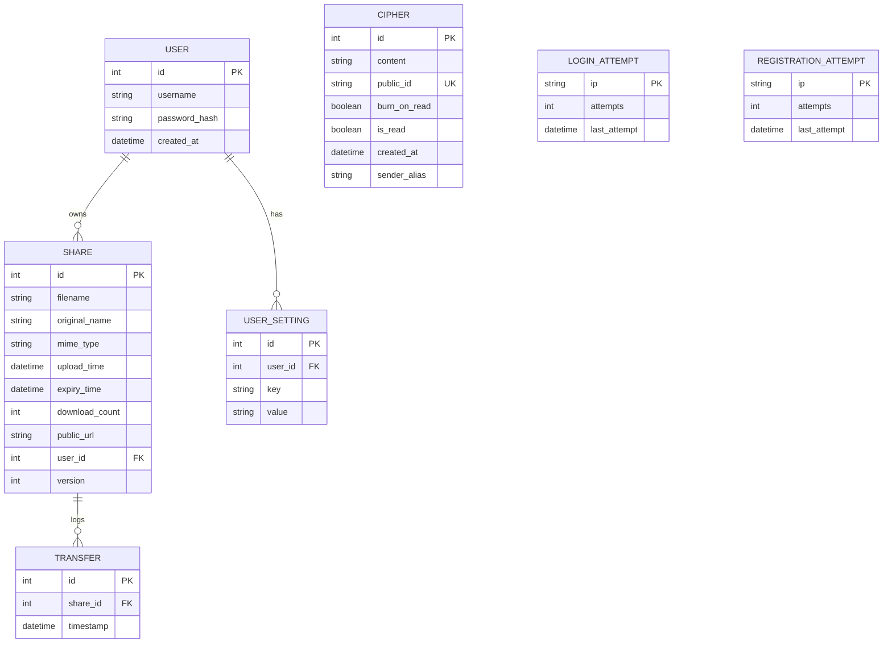

# Database Schema Reference — Obsidian Secure

This document specifies the SQLAlchemy models, columns, data types, constraints, and relationships for the Obsidian Secure database structure.

---

## Schema Overview

---

## Model Definitions

### 1. `User`
Stores credentials and tracking fields for authenticated accounts.
- **Fields**:
  - `id` (`Integer`, Primary Key): Auto-incrementing identifier.
  - `username` (`String(50)`, Unique, Not Null): Alphanumeric login identifier.
  - `password_hash` (`String(255)`, Not Null): Salted PBKDF2 hash of the password.
  - `created_at` (`DateTime`, Defaults to UTC now): Account creation timestamp.
- **Relationships**:
  - `shares`: One-to-Many relation with `Share` (cascade delete configured via Flask backref).
- **Security Notes**: User password hashes must be updated using secure cryptography libraries (`werkzeug.security`). The system does not store plaintext passwords.

### 2. `Share`
Tracks shared files metadata.
- **Fields**:
  - `id` (`Integer`, Primary Key): Auto-incrementing identifier.
  - `filename` (`String(255)`, Not Null): Cryptographically randomized filename on disk.
  - `original_name` (`String(255)`, Not Null): Original client-side filename.
  - `mime_type` (`String(255)`, Nullable): File content MIME type parsed during upload.
  - `upload_time` (`DateTime`, Defaults to UTC now): Time the file was uploaded.
  - `expiry_time` (`DateTime`, Not Null): Time after which the file becomes unavailable.
  - `download_count` (`Integer`, Defaults to 0): Telemetry counter for download accesses.
  - `public_url` (`String(512)`, Not Null): Canonical sharing link (does not contain key).
  - `user_id` (`Integer`, Foreign Key to `user.id`, Nullable): Identifies the uploading user.
  - `version` (`Integer`, Defaults to 2): Code indicator (`1` = Legacy OBSv2 chunked, `2` = V2 single-request AES-GCM).
- **Relationships**:
  - `transfers`: One-to-Many relation with `Transfer` (cascade delete-orphan configured).
- **Security Notes**: Filenames are stored on disk using the value of `filename` (which has a high-entropy hex prefix) to prevent path traversal and file enumeration.

### 3. `Transfer`
Logs file access events for user ledger feedback.
- **Fields**:
  - `id` (`Integer`, Primary Key): Auto-incrementing identifier.
  - `share_id` (`Integer`, Foreign Key to `share.id`, Not Null): Target share reference.
  - `timestamp` (`DateTime`, Defaults to UTC now): Event logging time.
- **Security Notes**: Automatically deleted if the parent `Share` record is removed (cascade delete-orphan).

### 4. `Cipher`
Stores client-side encrypted text messages.
- **Fields**:
  - `id` (`Integer`, Primary Key): Auto-incrementing identifier.
  - `content` (`Text`, Not Null): Base64 encoded ciphertext payload.
  - `public_id` (`String(32)`, Unique, Not Null): URL identification slug (high-entropy).
  - `burn_on_read` (`Boolean`, Defaults to True): If true, access is blocked after the first download query.
  - `is_read` (`Boolean`, Defaults to False): Indicates if the cipher has been decrypted.
  - `created_at` (`DateTime`, Defaults to UTC now): Creation timestamp.
  - `sender_alias` (`String(255)`, Nullable): Sender alias snapshot captured at creation.
- **Security Notes**: `content` holds raw ciphertext. Even if database access is compromised, ciphers cannot be read without the client's URL fragment decryption keys.

### 5. `Setting`
Generic key-value settings table.
- **Fields**:
  - `key` (`String(50)`, Primary Key): Setting key identifier.
  - `value` (`String(255)`, Not Null): Setting value.

### 6. `UserSetting`
Stores key-value configurations linked to individual users.
- **Fields**:
  - `id` (`Integer`, Primary Key): Auto-incrementing identifier.
  - `user_id` (`Integer`, Foreign Key to `user.id`, Not Null): Setting owner reference.
  - `key` (`String(50)`, Not Null): Config key (e.g. `alias`, `auto_revoke`, `ghost_mode`).
  - `value` (`String(255)`, Not Null): Config value.
- **Constraints**:
  - `UniqueConstraint('user_id', 'key', name='uq_user_setting')`: Restricts users to one value per config key.

### 7. `LoginAttempt`
Tracks failed login attempts to enforce rate limiting.
- **Fields**:
  - `ip` (`String(45)`, Primary Key): Client IPv4 or IPv6 address.
  - `attempts` (`Integer`, Defaults to 0): Failed attempts counter.
  - `last_attempt` (`DateTime`, Defaults to UTC now): Timestamp of the last login attempt.

### 8. `RegistrationAttempt`
Tracks registration attempts to enforce rate limiting.
- **Fields**:
  - `ip` (`String(45)`, Primary Key): Client IPv4 or IPv6 address.
  - `attempts` (`Integer`, Defaults to 0): Registration attempts counter.
  - `last_attempt` (`DateTime`, Defaults to UTC now): Timestamp of the last registration attempt.
